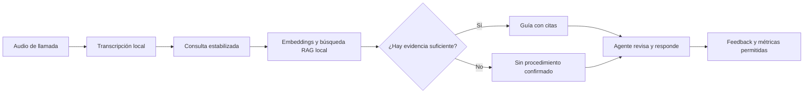

# QVAC Sovereign Agent

## Documento de producto y alcance del MVP

**Estado:** propuesta lista para especificación  
**Contexto:** Decentralized AI Hackathon  
**Plataforma principal:** QVAC mediante `@qvac/sdk`  
**Alcance lingüístico inicial:** español  
**Traducción:** fuera del alcance inicial

## 1. Resumen ejecutivo

QVAC Sovereign Agent es un copiloto local para agentes de atención al cliente. Escucha una conversación en vivo, convierte el audio en texto, identifica el problema expresado por el cliente y recupera información relevante de la base de conocimiento de la empresa. El agente recibe procedimientos y fragmentos verificables mientras mantiene el control de la respuesta.

La aplicación busca resolver un problema frecuente: los agentes no pueden memorizar todos los productos, procedimientos, excepciones y soluciones de una empresa. Esto produce búsquedas lentas, respuestas inconsistentes, transferencias innecesarias y dependencia de compañeros con más experiencia.

La inferencia principal se ejecuta localmente con QVAC. El audio, la transcripción y la base de conocimiento no necesitan enviarse a una API de IA externa. La telefonía, el CRM u otros servicios no relacionados con inferencia pueden seguir siendo remotos y deberán declararse claramente.

## 2. Problema

Un agente puede atender decenas de tipos de problemas, pero el conocimiento necesario está repartido entre manuales, preguntas frecuentes, políticas, procedimientos y comunicaciones internas. Durante una llamada debe entender al cliente, buscar información, verificar que esté vigente y explicarla con rapidez.

Los buscadores tradicionales dependen de que el agente conozca las palabras exactas del documento. Un cliente puede decir «el router se reinicia solo» mientras la documentación habla de «interrupciones periódicas de alimentación». La diferencia de vocabulario dificulta encontrar el procedimiento correcto.

Las consecuencias que la empresa puede medir son:

- Mayor tiempo promedio de atención.
- Menor resolución en el primer contacto.
- Más transferencias y escalaciones.
- Respuestas basadas en documentos desactualizados.
- Mayor tiempo de capacitación para agentes nuevos.
- Riesgo de exponer conversaciones o documentos internos a proveedores externos de IA.

## 3. Usuarios

### Agente de atención

Necesita comprender el problema y encontrar material confiable sin abandonar la conversación ni navegar por múltiples sistemas.

### Supervisor

Necesita que las respuestas sean consistentes, que los agentes utilicen documentación vigente y que las sugerencias incorrectas puedan auditarse.

### Administrador de conocimiento

Necesita controlar qué documentos se indexan, qué versión está vigente y cuándo debe retirarse una instrucción.

### Equipo de seguridad y cumplimiento

Necesita conocer qué datos salen del dispositivo, cuánto tiempo se conservan y quién puede consultar cada colección documental.

## 4. Propuesta de valor

> Cada agente puede consultar el conocimiento aprobado de la empresa durante una llamada, con respuestas respaldadas por fuentes y con la inferencia ejecutándose localmente.

La primera hipótesis de valor es reducir el tiempo necesario para encontrar el procedimiento correcto. Las mejoras en resolución, capacitación o costos deberán validarse mediante una comparación contra el proceso actual; no se asumirán como resultados garantizados.

## 5. Flujo principal

1. El agente inicia una sesión y selecciona la línea de negocio correspondiente.
2. La aplicación carga previamente los modelos y abre la colección documental autorizada.
3. El audio de la llamada entra al motor local de transcripción.
4. La interfaz muestra una transcripción provisional y luego estabiliza cada intervención.
5. Al detectar el final de una intervención, el sistema construye una consulta de recuperación.
6. QVAC busca los fragmentos semánticamente relacionados dentro de la base local.
7. El sistema filtra documentos vencidos, duplicados o no autorizados.
8. La interfaz presenta hasta tres fragmentos con título, versión, fecha y ubicación de origen.
9. Cuando existe evidencia suficiente, el sistema genera una guía breve para el agente.
10. El agente abre la fuente, utiliza la guía o marca la sugerencia como incorrecta.
11. Al cerrar la llamada, se aplica la política de retención configurada.

## 6. Ejemplo de uso

Una empresa de telecomunicaciones recibe esta consulta:

> «El internet se cae cada diez minutos. La luz del módem cambia a rojo y después vuelve sola».

La aplicación transcribe la intervención y recupera:

- Procedimiento: interrupciones periódicas del servicio.
- Fragmento relevante: verificación del indicador óptico y estado de conexión.
- Documento: guía de soporte residencial.
- Versión y fecha de vigencia.
- Preguntas sugeridas que aparecen explícitamente en el procedimiento.

La interfaz no debe afirmar una causa si la documentación no la respalda. Si encuentra varios procedimientos incompatibles o ninguno supera el umbral de confianza, debe mostrar «No se encontró un procedimiento confirmado» y permitir la búsqueda manual.

## 7. Funciones diferenciadoras

### 7.1 Evidence Gate

Una guía solo puede mostrarse como respaldada cuando cada afirmación se vincula a un fragmento recuperado de un documento vigente. Si no existe evidencia suficiente, la aplicación se abstiene de generar una solución.

### 7.2 Critical Data Lock

El sistema identifica entidades sensibles para el flujo operativo, como números de contrato, códigos de error, modelos, cantidades, fechas y negaciones. Estas entidades deben mostrarse junto al texto original y marcarse cuando la confianza de transcripción sea baja.

El MVP no debe modificar ni completar automáticamente esos valores.

### 7.3 Zero-Retention Mode

La sesión puede configurarse para mantener audio y transcripción únicamente en memoria. Al cerrarla, la aplicación elimina el contenido temporal y conserva solo métricas agregadas y feedback autorizado.

La demo debe demostrar este comportamiento inspeccionando el almacenamiento antes y después de una sesión.

### 7.4 Conocimiento versionado

Cada fragmento recuperado conserva:

- Identificador del documento.
- Título.
- Versión.
- Fecha de vigencia.
- Sección o página.
- Estado: vigente, vencido o borrador.

Los documentos vencidos o en borrador no pueden alimentar respuestas operativas.

### 7.5 Abstención explícita

La ausencia de información es un resultado válido. El sistema debe indicar cuándo no encuentra respaldo, en lugar de producir una respuesta plausible sin fuente.

## 8. Papel de QVAC

QVAC proporciona la ejecución local de las operaciones principales de IA:

- Transcripción de audio en el dispositivo.
- Generación de embeddings.
- Ingesta y búsqueda RAG sobre documentos locales.
- Generación breve y estructurada de material de apoyo.
- Registro de carga, prompts, tokens, TTFT y throughput.

El MVP utilizará `@qvac/sdk` para las operaciones principales de inferencia y RAG. Las funciones deterministas —control de versiones, permisos, retención, validación de entidades y reglas de interfaz— permanecerán fuera del modelo.

Referencias técnicas:

- [QVAC: transcripción](https://docs.qvac.tether.io/ai-capabilities/transcription/)
- [QVAC: RAG](https://docs.qvac.tether.io/ai-capabilities/rag/)
- [QVAC SDK](https://qvac.tether.io/products/sdk)

## 9. Elegibilidad para el reto Psy

Esta versión elimina TranslatePsy y no asigna una función central a MedPsy o VisionPsy. Por tanto, aunque demuestra capacidades de QVAC, **no cumple por sí sola el requisito del reto específico QVAC Psy que exige que al menos un modelo Psy sea central en el flujo principal**.

Existen dos caminos honestos:

1. Presentarla en una categoría general que acepte aplicaciones QVAC sin un modelo Psy central.
2. Recuperar una función bilingüe central con TranslatePsy y competir en QVAC Psy.

No se debe introducir un modelo Psy de manera decorativa únicamente para marcar el requisito.

## 10. Arquitectura propuesta

### Cliente de escritorio

- Captura el audio permitido por el entorno de telefonía.
- Presenta transcripción, resultados, fuentes y feedback.
- Mantiene el agente humano como responsable de la respuesta.

### Runtime local de QVAC

- Mantiene modelos precargados.
- Ejecuta transcripción, embeddings, recuperación y generación.
- Emite métricas de rendimiento estructuradas.

### Knowledge Workspace

- Contiene documentos aprobados.
- Almacena fragmentos, embeddings y metadatos.
- Permite reconstruir el índice cuando cambia una versión.

### Policy Layer

- Decide qué colecciones puede consultar el agente.
- Excluye documentos vencidos o no aprobados.
- Aplica la retención de la sesión.
- Valida entidades críticas mediante reglas deterministas.

### Adaptadores opcionales

- Entrada de audio desde archivo para la demo.
- Captura de micrófono para una simulación en vivo.
- Integración futura con softphone o PBX.
- Integración futura con CRM mediante APIs no destinadas a inferencia.

## 11. Modelo de datos conceptual

### KnowledgeDocument

- `documentId`
- `title`
- `version`
- `effectiveAt`
- `expiresAt`
- `status`
- `businessLine`
- `sourceLocation`

### KnowledgeChunk

- `chunkId`
- `documentId`
- `content`
- `section`
- `page`
- `embeddingReference`

### CallSession

- `sessionId`
- `startedAt`
- `endedAt`
- `businessLine`
- `retentionPolicy`
- `transcriptState`

### Suggestion

- `suggestionId`
- `sessionId`
- `queryText`
- `supportingChunks`
- `confidenceState`
- `createdAt`
- `latencyMs`
- `agentFeedback`

### PerformanceRecord

- `modelId`
- `quantization`
- `hardware`
- `loadTimeMs`
- `promptTokens`
- `outputTokens`
- `ttftMs`
- `tokensPerSecond`
- `retrievalLatencyMs`
- `endToEndLatencyMs`

## 12. Requisitos funcionales del MVP

- Ingerir una colección de documentos locales con metadatos de versión.
- Rechazar documentos que no estén marcados como vigentes.
- Cargar los modelos antes de comenzar la sesión.
- Transcribir audio grabado o capturado en vivo.
- Actualizar la búsqueda al finalizar cada intervención, no por cada palabra.
- Mostrar un máximo de tres fragmentos relevantes.
- Abrir el texto completo que respalda una sugerencia.
- Mostrar un estado explícito cuando no exista evidencia suficiente.
- Permitir feedback «útil», «incorrecto» o «documentación insuficiente».
- Aplicar Zero-Retention Mode al cerrar la sesión.
- Exportar un registro de rendimiento en JSON.

## 13. Requisitos no funcionales

- La inferencia principal debe funcionar sin una conexión a servicios externos de IA.
- La interfaz nunca debe ocultar la fuente de una sugerencia.
- Los errores de transcripción no deben sobrescribir el audio o texto original disponible durante la sesión.
- El sistema debe continuar operativo cuando falle la generación, mostrando resultados de recuperación sin resumen.
- La base documental utilizada en la demo debe ser ficticia, autorizada o de licencia compatible.
- Los modelos, cuantizaciones y especificaciones de hardware deben declararse con precisión.
- Las APIs remotas y componentes de terceros deben documentarse.

## 14. Alcance para 48 horas

### Obligatorio

- Una línea de negocio ficticia: soporte de internet residencial.
- Entre 15 y 25 artículos de conocimiento.
- Entre 10 y 20 consultas de evaluación.
- Transcripción local en español.
- Búsqueda RAG local.
- Resultados con citas y metadatos.
- Abstención cuando no exista evidencia.
- Feedback del agente.
- Registro de rendimiento requerido por el reto.
- Demo reproducible en el hardware declarado.

### Deseable

- Zero-Retention Mode verificable.
- Critical Data Lock para códigos y números.
- Captura de micrófono en vivo.
- Comparación contra búsqueda por palabras clave.

### Fuera del alcance

- Traducción entre idiomas.
- Respuesta automática al cliente.
- Diagnósticos automáticos del estado de una cuenta.
- Modificación de planes, facturas o contratos.
- Integración completa con CRM o plataforma CCaaS.
- Despliegue empresarial multiusuario.
- Certificaciones de seguridad o cumplimiento.
- Afirmaciones de ahorro sin un cálculo de costo total.

## 15. Estrategia de evaluación

La evaluación utilizará casos con una respuesta documental conocida. Cada caso incluirá audio, transcripción esperada, entidades críticas y el artículo correcto.

### Métricas de calidad

- Exactitud de transcripción general.
- Exactitud de códigos, números y negaciones.
- `Precision@1`: frecuencia con la que el primer resultado es correcto.
- `Recall@3`: frecuencia con la que el resultado correcto aparece entre los tres primeros.
- Porcentaje de afirmaciones con una fuente válida.
- Tasa de abstención correcta.
- Tasa de sugerencias aceptadas y rechazadas.

### Métricas operativas

- Tiempo para localizar el procedimiento con la aplicación.
- Tiempo para localizarlo mediante búsqueda manual.
- Latencia desde el final de la intervención hasta el primer resultado.
- Tiempo de carga del modelo.
- TTFT.
- Tokens procesados.
- Throughput.

### Hipótesis de éxito del prototipo

- El artículo correcto aparece como primer resultado en la mayoría de los casos representativos.
- Ninguna respuesta respaldada contiene una afirmación sin vínculo a la fuente.
- Los códigos y números críticos permanecen visibles y sin alteraciones silenciosas.
- El sistema supera la búsqueda manual en tiempo sin reducir la exactitud.
- La experiencia principal continúa funcionando al bloquear el acceso a APIs externas de IA.

Los umbrales definitivos deben fijarse después de medir el rendimiento base en el hardware disponible.

## 16. Guion del video de cinco minutos

### 0:00–0:30 — Problema

Mostrar a un agente buscando entre varios documentos mientras atiende una consulta.

### 0:30–1:00 — Arquitectura y privacidad

Explicar que la inferencia y el conocimiento funcionan localmente. Distinguir la conexión telefónica de la conexión a servicios de IA.

### 1:00–2:30 — Flujo principal

Reproducir una consulta de un cliente, mostrar la transcripción progresiva y la recuperación del procedimiento correcto con su fuente.

### 2:30–3:20 — Casos de seguridad

Mostrar un código crítico, un documento vencido y una consulta sin respuesta. Demostrar que el sistema preserva el código, excluye el documento y se abstiene.

### 3:20–4:10 — Zero-Retention Mode

Cerrar la sesión y demostrar que no queda audio ni transcripción persistente.

### 4:10–4:40 — Evidencia

Presentar resultados comparativos contra búsqueda manual y métricas de calidad.

### 4:40–5:00 — Rendimiento y cierre

Mostrar hardware, modelo, cuantización, carga, TTFT y throughput. Cerrar con la propuesta de valor.

## 17. Riesgos y mitigaciones

| Riesgo | Impacto | Mitigación del MVP |
|---|---|---|
| Transcripción incorrecta | Recuperación equivocada | Buscar al final de cada intervención, resaltar baja confianza y medir entidades críticas |
| Documentación desactualizada | Procedimiento incorrecto | Filtrar por estado, versión y vigencia antes de recuperar |
| Alucinación | Guía sin respaldo | Evidence Gate, citas obligatorias y abstención |
| Alta latencia | Sugerencia llega tarde | Precargar modelos, limitar resultados y medir p50/p95 |
| Sobrecarga visual | Distracción del agente | Máximo de tres resultados y una guía breve |
| Datos persistentes | Riesgo de confidencialidad | Zero-Retention Mode y pruebas del almacenamiento |
| Base documental deficiente | Resultados poco útiles | Dataset pequeño, curado y con dueño documental |
| Costo local subestimado | Caso empresarial débil | Separar costo de inferencia de costo total y evitar promesas no medidas |

## 18. Seguridad y privacidad

El prototipo debe documentar su frontera de confianza. Ejecutar IA localmente evita enviar contenido a un proveedor externo de inferencia, pero no protege automáticamente la telefonía, el CRM, el sistema operativo o el almacenamiento.

La implementación debe contemplar:

- Procesamiento temporal en memoria cuando sea posible.
- Cifrado del índice y documentos en una versión de producción.
- Permisos por colección documental.
- Eliminación verificable según la política de retención.
- Datos ficticios o anonimizados durante el hackathon.
- Registro de eventos sin almacenar el contenido completo de la conversación.

## 19. Modelo de negocio por validar

Los compradores potenciales son empresas con alto volumen de llamadas, documentación compleja o restricciones sobre el uso de IA externa.

Las hipótesis comerciales son:

- Licencia por puesto o por instalación local.
- Menor costo variable de inferencia frente a cobro por minuto o token.
- Menor tiempo de entrenamiento para agentes nuevos.
- Menos escalaciones por desconocimiento del procedimiento.

Estas hipótesis requieren entrevistas y un cálculo de costo total que incluya hardware, despliegue, soporte, energía, actualizaciones y seguridad.

## 20. Decisiones abiertas para el Main Flow

Las siguientes decisiones deben resolverse durante `grill-with-docs`:

1. Hardware exacto de la demostración.
2. Modelo de transcripción y cuantización.
3. Modelo local utilizado para sintetizar la guía.
4. Formato de los documentos de conocimiento.
5. Umbral y lógica de Evidence Gate.
6. Método de captura de audio en la demo.
7. Política exacta de retención.
8. Dataset y método de evaluación humana.
9. Categoría final del hackathon, debido a la ausencia de un modelo Psy central.
10. Nombre definitivo del producto.

## 21. Criterio de salida del hackathon

El proyecto estará listo para entregar cuando otra persona pueda clonar el repositorio, instalar dependencias, cargar los modelos declarados, reproducir los casos de prueba, ejecutar la demostración sin una API externa de IA y obtener un registro estructurado de rendimiento.

