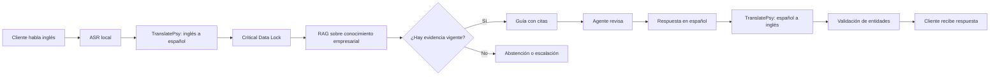

# QVAC Sovereign Agent con TranslatePsy

## Documento de producto y alcance del MVP bilingüe

**Estado:** propuesta recomendada para especificación  
**Contexto:** Decentralized AI Hackathon — reto QVAC Psy  
**Plataforma:** QVAC mediante `@qvac/sdk`  
**Modelo Psy central:** TranslatePsy  
**Idiomas del MVP:** español e inglés  
**Sector de demostración:** soporte de internet residencial en Panamá

## 1. Resumen ejecutivo

QVAC Sovereign Agent es un copiloto bilingüe para centros de atención al cliente. Permite que un agente que trabaja en español atienda a un cliente que habla inglés. La aplicación transcribe la conversación, la traduce localmente con TranslatePsy, consulta la base de conocimiento privada de la empresa mediante RAG y muestra una guía respaldada por documentos vigentes.

La respuesta preparada para el agente se traduce al idioma del cliente. El agente revisa y confirma el contenido antes de comunicarlo. Audio, transcripciones, traducciones, documentos y operaciones principales de IA permanecen en el entorno local y no necesitan enviarse a una API externa de inferencia.

TranslatePsy no es una función adicional: hace posible el flujo principal. Sin su traducción bidireccional, el agente monolingüe no podría atender esa llamada.

## 2. Problema empresarial

Un call center puede recibir consultas de clientes que no hablan el idioma principal de sus agentes. Las respuestas habituales son transferir la llamada, esperar a un agente bilingüe o finalizar la atención sin resolver el problema. Incluso cuando ambos hablan el mismo idioma, el agente puede desconocer el procedimiento aplicable y perder tiempo buscando entre múltiples documentos.

El problema combina dos brechas:

1. **Brecha lingüística:** cliente y agente no pueden comunicarse con suficiente claridad.
2. **Brecha de conocimiento:** el agente no conoce todos los productos, errores y procedimientos de la empresa.

Las consecuencias que se deben validar con una empresa real son:

- Transferencias hacia una cola bilingüe.
- Mayor tiempo de espera para clientes de otros idiomas.
- Abandono de llamadas.
- Prima de contratación o disponibilidad limitada de agentes bilingües.
- Búsquedas lentas en la base de conocimiento.
- Respuestas inconsistentes o basadas en documentos vencidos.
- Exposición de conversaciones y documentos al utilizar servicios externos de IA.

## 3. Propuesta de valor

> Un agente puede atender una consulta en otro idioma utilizando procedimientos aprobados, mientras la voz, la traducción y el conocimiento empresarial se procesan localmente.

La propuesta no afirma que TranslatePsy traduzca mejor que todos los servicios en la nube. Su valor debe demostrarse en la combinación de:

- Traducción especializada para el flujo de atención.
- Inferencia local y control de la información.
- Respuestas vinculadas a documentación empresarial.
- Protección de códigos, cantidades y datos críticos.
- Costo de inferencia sin cobro variable por minuto o token de una API externa.

El costo total deberá incluir hardware, energía, soporte, instalación y actualización de modelos.

## 4. Usuarios

### Cliente

Necesita explicar su problema y comprender la respuesta aunque no hable el idioma del agente.

### Agente monolingüe

Necesita entender al cliente, consultar el procedimiento correcto y responder sin abandonar su escritorio de trabajo.

### Supervisor

Necesita evaluar calidad, traducciones rechazadas, escalaciones y uso de documentación vigente.

### Administrador de conocimiento

Necesita controlar los documentos que pueden respaldar una respuesta, su versión y fecha de vigencia.

### Seguridad y cumplimiento

Necesita saber dónde se procesan y conservan el audio, la transcripción, la traducción y la base documental.

## 5. Escenario de demostración

Un cliente angloparlante llama al soporte de una empresa panameña de telecomunicaciones:

> “My internet disconnects every ten minutes. The modem light turns red and then it reconnects by itself.”

La aplicación muestra al agente:

> “Mi internet se desconecta cada diez minutos. La luz del módem se pone roja y después vuelve a conectarse sola.”

El sistema recupera de la base local:

- Procedimiento para interrupciones periódicas.
- Sección relacionada con el indicador rojo del módem.
- Documento, versión, fecha y fragmento original.
- Preguntas de verificación incluidas en el procedimiento.

El agente selecciona una pregunta aprobada:

> “¿El indicador rojo permanece encendido o parpadea?”

TranslatePsy genera la versión para el cliente:

> “Does the red indicator stay on or blink?”

El agente ve ambas versiones antes de enviarla o reproducirla. La conversación continúa por turnos hasta resolver el caso o determinar que debe escalarse.

## 6. Flujo principal

1. El agente selecciona español como su idioma e inglés como idioma del cliente.
2. La aplicación precarga los modelos de transcripción, TranslatePsy, embeddings y generación.
3. Se abre la colección documental correspondiente a la línea de negocio.
4. El cliente habla en inglés.
5. QVAC transcribe localmente el audio del cliente.
6. TranslatePsy traduce la intervención estable al español.
7. Critical Data Lock compara original, transcripción y traducción para proteger entidades críticas.
8. El sistema construye una consulta RAG en el idioma de la documentación.
9. QVAC recupera únicamente fragmentos vigentes y autorizados.
10. Evidence Gate decide si existe evidencia suficiente para presentar una guía.
11. El agente revisa la traducción, la guía y las fuentes.
12. El agente selecciona o redacta una respuesta en español.
13. TranslatePsy genera la respuesta en inglés.
14. El agente revisa ambas versiones y confirma.
15. La respuesta se muestra como texto o se reproduce con síntesis de voz local si esa función está habilitada.
16. Al finalizar, la política de retención elimina o conserva los datos autorizados.

## 7. Por qué TranslatePsy es central

TranslatePsy participa dos veces en cada turno completo:

- Convierte al idioma del agente lo expresado por el cliente.
- Convierte al idioma del cliente la respuesta revisada por el agente.

Si TranslatePsy no está disponible, el sistema puede conservar la transcripción y RAG, pero no puede completar la experiencia bilingüe. Esto evita utilizar el modelo Psy de manera decorativa y satisface conceptualmente el requisito de que desempeñe una función central.

La pareja exacta de modelos, formato y cuantización debe verificarse en el hardware objetivo antes de congelar la especificación. El repositorio debe declarar el identificador real del modelo utilizado y no usar nombres comerciales imprecisos.

Referencia:

- [TranslatePsy-EuroNano](https://huggingface.co/qvac/TranslatePsy-EuroNano)
- [QVAC: traducción](https://docs.qvac.tether.io/ai-capabilities/translation/)

## 8. Funciones diferenciadoras

### 8.1 Bilingual Agent Bridge

La interfaz separa claramente:

- Texto original del cliente.
- Transcripción reconocida.
- Traducción para el agente.
- Respuesta redactada por el agente.
- Traducción preparada para el cliente.

Ninguna traducción se comunica automáticamente en el MVP. El agente siempre puede corregirla o solicitar una reformulación más sencilla.

### 8.2 Critical Data Lock

La aplicación identifica entidades que no deben cambiar entre idiomas:

- Números de cuenta o contrato.
- Códigos de error.
- Modelos de equipo.
- Fechas, horas y cantidades.
- Monedas y precios.
- Direcciones.
- Negaciones como “no”, “nunca” o “sin”.

Si una entidad desaparece o cambia durante la traducción, se bloquea la respuesta y se muestra la diferencia al agente.

### 8.3 Evidence Gate

La aplicación distingue entre traducción y solución. Una frase puede traducirse correctamente aunque el sistema no conozca la solución. La guía operativa solo aparece cuando está respaldada por un fragmento vigente de la base empresarial.

### 8.4 Response Contract

Cada respuesta propuesta debe cumplir un contrato estructurado:

- Intención detectada.
- Respuesta breve para el cliente.
- Pasos respaldados.
- Fuentes utilizadas.
- Entidades críticas conservadas.
- Estado de confianza.
- Motivo de abstención, si aplica.

### 8.5 Zero-Retention Mode

En este modo, audio, transcripción y traducciones permanecen en memoria durante la llamada. Al cerrar la sesión se eliminan, y únicamente se conservan métricas agregadas y feedback autorizado.

La demo debe verificar el almacenamiento antes y después de cerrar la sesión. Esta función no implica que la telefonía o el CRM sean locales; la frontera se documentará con precisión.

### 8.6 Knowledge Gap Signal

Cuando el sistema se abstiene porque la documentación es insuficiente, registra un evento sin contenido sensible. La empresa puede conocer qué tipos de consultas carecen de procedimientos adecuados y mejorar su base de conocimiento.

## 9. Papel de QVAC

Todas las operaciones principales de IA y RAG deberán utilizar `@qvac/sdk`:

- Transcripción local de la voz.
- Traducción bidireccional con TranslatePsy.
- Embeddings e ingesta documental.
- Búsqueda RAG local.
- Generación estructurada de una guía respaldada.
- Síntesis de voz local, si entra en el alcance final.
- Registro de carga, prompts, tokens, TTFT y throughput.

Las siguientes operaciones serán deterministas:

- Validación de versiones y fechas.
- Control de permisos.
- Comparación de entidades críticas.
- Política de retención.
- Estados de interfaz.
- Decisión final del agente.

Referencias:

- [QVAC SDK](https://qvac.tether.io/products/sdk)
- [QVAC: transcripción](https://docs.qvac.tether.io/ai-capabilities/transcription/)
- [QVAC: traducción](https://docs.qvac.tether.io/ai-capabilities/translation/)
- [QVAC: RAG](https://docs.qvac.tether.io/ai-capabilities/rag/)

## 10. Arquitectura conceptual

### Audio Gateway

Recibe un archivo de audio o una entrada de micrófono. Una integración futura podrá capturar canales separados desde un softphone o PBX.

### Local AI Runtime

Administra modelos precargados y ejecuta ASR, TranslatePsy, embeddings, recuperación y generación.

### Conversation Orchestrator

Mantiene el estado de cada turno, decide cuándo una transcripción está estable y coordina traducción, recuperación y presentación.

### Critical Data Guard

Extrae entidades mediante reglas y compara los valores entre original, transcripción, traducción y respuesta.

### Knowledge Workspace

Contiene documentos, fragmentos, embeddings y metadatos de vigencia. Para el hackathon puede emplearse el almacenamiento integrado de prototipo; una versión empresarial requerirá evaluar un almacén local apropiado.

### Evidence Policy

Excluye documentos vencidos o no autorizados y exige citas antes de presentar una solución como respaldada.

### Agent Desktop

Muestra el original, traducción, evidencia, respuesta y alertas sin cubrir la interfaz principal de atención.

### Metrics Recorder

Registra rendimiento sin conservar contenido sensible cuando Zero-Retention Mode está activo.

## 11. Estados principales de la interfaz

### Preparando

Los modelos y la colección documental se están cargando. No se inicia la llamada de demostración hasta que los componentes obligatorios estén listos.

### Escuchando

La aplicación recibe audio y presenta transcripción provisional.

### Traduciendo

TranslatePsy procesa una intervención estabilizada. La interfaz conserva visible el original.

### Buscando evidencia

El sistema consulta la colección local y filtra resultados por vigencia.

### Sugerencia disponible

Existe una guía respaldada. El agente puede revisar cada fuente.

### Revisión requerida

Critical Data Lock encontró una posible diferencia en números, códigos o negaciones.

### Sin evidencia

No se encontró un procedimiento confiable. La aplicación permite buscar manualmente o escalar.

### Sesión cerrada

Se aplicó la política de retención y se generó el registro de rendimiento permitido.

## 12. Modelo de datos conceptual

### LanguagePair

- `customerLanguage`
- `agentLanguage`
- `translationModelId`
- `translationModelVersion`
- `quantization`

### Utterance

- `utteranceId`
- `speaker`
- `sourceLanguage`
- `audioReference`
- `transcript`
- `transcriptConfidence`
- `startedAt`
- `endedAt`

### Translation

- `translationId`
- `utteranceId`
- `sourceText`
- `translatedText`
- `sourceLanguage`
- `targetLanguage`
- `criticalEntities`
- `validationState`
- `latencyMs`

### KnowledgeDocument

- `documentId`
- `title`
- `version`
- `effectiveAt`
- `expiresAt`
- `status`
- `businessLine`
- `language`
- `sourceLocation`

### Suggestion

- `suggestionId`
- `intent`
- `agentLanguageText`
- `customerLanguageText`
- `supportingChunks`
- `criticalEntityState`
- `confidenceState`
- `agentDecision`

### PerformanceRecord

- `component`
- `modelId`
- `quantization`
- `hardware`
- `loadTimeMs`
- `inputTokens`
- `outputTokens`
- `ttftMs`
- `tokensPerSecond`
- `translationLatencyMs`
- `retrievalLatencyMs`
- `endToEndLatencyMs`

## 13. Requisitos funcionales del MVP

- Configurar español como idioma del agente e inglés como idioma del cliente.
- Cargar TranslatePsy mediante QVAC.
- Transcribir una intervención en inglés localmente.
- Traducir la intervención al español.
- Mostrar original y traducción simultáneamente.
- Buscar evidencia sobre la consulta traducida.
- Mostrar hasta tres fragmentos con fuente, versión y vigencia.
- Generar una guía breve y respaldada para el agente.
- Traducir una respuesta confirmada de español a inglés.
- Detectar cambios en códigos, números, fechas y negaciones.
- Bloquear respuestas con discrepancias críticas no confirmadas.
- Abstenerse cuando no exista evidencia suficiente.
- Recoger feedback del agente.
- Aplicar la política de retención al cerrar.
- Exportar un registro de rendimiento estructurado.

## 14. Requisitos no funcionales

- La inferencia principal debe ejecutarse sin APIs externas de IA.
- El sistema debe permanecer útil si falla la generación: traducción y resultados RAG seguirán disponibles.
- El original nunca debe quedar oculto por la traducción.
- La respuesta no debe emitirse sin confirmación del agente.
- Todos los modelos, formatos, cuantizaciones y requisitos de hardware deben declararse.
- La latencia debe medirse por componente y de extremo a extremo.
- Los documentos de demostración deben ser ficticios, autorizados o compatibles con su licencia.
- Los servicios remotos no relacionados con IA deben divulgarse.
- Los registros de rendimiento no deben contener información personal.

## 15. Alcance para 48 horas

### Obligatorio

- Una línea de negocio ficticia de telecomunicaciones.
- Flujo inglés → español → RAG → español → inglés.
- TranslatePsy como modelo central.
- Entre 15 y 25 artículos de conocimiento en español.
- Entre 10 y 20 conversaciones bilingües de evaluación.
- Transcripción y traducción locales.
- RAG con fuentes visibles.
- Evidence Gate.
- Critical Data Lock para códigos y números.
- Registro de rendimiento requerido por el reto.
- Ejecución reproducible en hardware declarado.

### Deseable

- Entrada de micrófono en vivo.
- Zero-Retention Mode verificable.
- Síntesis de voz local para la respuesta.
- Knowledge Gap Signal.
- Comparación contra un agente utilizando búsqueda manual.

### Fuera del alcance

- Más de dos idiomas.
- Traducción continua con personas hablando simultáneamente.
- Respuesta automática sin revisión.
- Integración completa con CRM o CCaaS.
- Modificación de cuentas, planes, contratos o facturas.
- Análisis emocional del cliente.
- Certificación empresarial de seguridad.
- Sustitución de agentes humanos.

## 16. Dataset de evaluación

Cada caso de prueba debe contener:

- Audio en inglés.
- Transcripción esperada.
- Traducción de referencia revisada por una persona bilingüe.
- Entidades críticas esperadas.
- Intención esperada.
- Documento y fragmento correctos.
- Respuesta aprobada en español e inglés.
- Caso esperado: responder, pedir aclaración o abstenerse.

El conjunto debe incluir:

- Ruido ambiental moderado.
- Diferentes velocidades de habla.
- Números de contrato ficticios.
- Códigos de error y modelos de módem.
- Negaciones.
- Consultas ambiguas.
- Preguntas sin respuesta en la documentación.
- Documentos vencidos que no deben utilizarse.

## 17. Métricas

### Transcripción

- Error general de palabras.
- Exactitud de códigos, números y negaciones.
- Latencia desde el final de la intervención.

### Traducción

- Adecuación evaluada por una persona bilingüe.
- Conservación de intención.
- Conservación exacta de entidades críticas.
- Tasa de traducciones aceptadas sin corrección.
- Latencia por dirección de idioma.

### Recuperación y respuesta

- `Precision@1`.
- `Recall@3`.
- Tasa de citas válidas.
- Tasa de abstención correcta.
- Tasa de sugerencias aceptadas y rechazadas.

### Negocio

- Tiempo para encontrar el procedimiento.
- Transferencias evitables en el conjunto simulado.
- Tiempo total de atención en comparación con búsqueda manual.
- Número de correcciones requeridas por conversación.

### Rendimiento requerido

- Carga de cada modelo.
- Prompts utilizados.
- Tokens de entrada y salida.
- TTFT.
- Throughput.
- Latencia de traducción.
- Latencia RAG.
- Latencia completa por turno.

## 18. Criterios de éxito

El MVP se considerará exitoso cuando:

- Complete una conversación bilingüe de principio a fin sin una API externa de IA.
- TranslatePsy sea necesario para completar el flujo.
- El agente pueda verificar la traducción y la fuente utilizada.
- El sistema preserve códigos, números y negaciones o bloquee la respuesta.
- Se abstenga cuando la documentación no contenga una solución.
- El artículo correcto aparezca antes que resultados irrelevantes en la mayoría de los casos de evaluación.
- El registro permita reproducir el rendimiento en el hardware declarado.

Los umbrales numéricos deben fijarse después de ejecutar un benchmark inicial. No se deben inventar métricas favorables antes de medir.

## 19. Guion del video de cinco minutos

### 0:00–0:30 — Problema

Un cliente habla inglés; el agente habla español y debe transferir la llamada porque tampoco encuentra rápidamente el procedimiento.

### 0:30–1:00 — Propuesta

Presentar QVAC Sovereign Agent y mostrar que los modelos y documentos están cargados localmente.

### 1:00–2:20 — Conversación bilingüe

El cliente describe una desconexión. Mostrar audio, transcripción, traducción y detección de intención.

### 2:20–3:10 — RAG verificable

Mostrar el procedimiento correcto, abrir la fuente y explicar Evidence Gate.

### 3:10–3:50 — Respuesta al cliente

El agente confirma una respuesta en español, TranslatePsy la convierte a inglés y el cliente continúa la conversación.

### 3:50–4:20 — Casos de fallo

Mostrar un código alterado que Critical Data Lock bloquea y una consulta sin evidencia que produce abstención.

### 4:20–4:40 — Privacidad

Bloquear acceso a APIs externas de IA y cerrar la sesión con Zero-Retention Mode.

### 4:40–5:00 — Evidencia y rendimiento

Mostrar modelo, cuantización, hardware, calidad medida, carga, TTFT, throughput y latencia completa.

## 20. Riesgos y mitigaciones

| Riesgo | Impacto | Mitigación del MVP |
|---|---|---|
| Error de ASR | Traducción y búsqueda incorrectas | Original visible, turnos estabilizados y evaluación de entidades críticas |
| Traducción incorrecta | Cliente y agente entienden cosas distintas | Revisión humana, traducción bidireccional y Critical Data Lock |
| Pipeline en cascada | Un error afecta etapas posteriores | Métricas por componente, estados de confianza y posibilidad de corregir el texto |
| Documento vencido | Procedimiento incorrecto | Filtro determinista por estado y vigencia |
| Alucinación | Guía no respaldada | Evidence Gate y abstención |
| Latencia acumulada | Conversación poco natural | Modelos precargados, procesamiento por turnos y respuestas breves |
| Demasiadas sugerencias | Sobrecarga del agente | Máximo de tres fuentes y un resultado principal |
| Datos persistentes | Riesgo de confidencialidad | Zero-Retention Mode y verificación de almacenamiento |
| TTS poco natural | Mala experiencia del cliente | Mantener texto como flujo obligatorio y TTS como función deseable |
| Costo local subestimado | Propuesta comercial débil | Medir hardware y calcular costo total antes de afirmar ahorro |

## 21. Privacidad y frontera de confianza

La afirmación correcta es:

> La inferencia principal de IA y el conocimiento empresarial pueden procesarse localmente sin enviarse a un proveedor externo de IA.

La aplicación no debe afirmar que toda la llamada funciona sin internet. Una llamada VoIP puede necesitar conectividad y el CRM puede ser remoto. La documentación debe divulgar:

- Cómo entra el audio.
- Qué componentes requieren red.
- Qué datos procesa QVAC.
- Qué archivos se crean.
- Cuándo se eliminan.
- Qué métricas se conservan.
- Qué componentes pertenecen a terceros.

## 22. Hipótesis de negocio

El segmento inicial debe cumplir al menos una de estas condiciones:

- Mantiene una cola secundaria de clientes angloparlantes.
- Transfiere llamadas por falta de agentes bilingües.
- Tiene políticas que limitan el envío de voz o documentos a proveedores externos de IA.
- Posee una base de conocimiento extensa y difícil de consultar.
- Paga por uso de servicios de transcripción, traducción o generación.

Las entrevistas deben investigar:

- Porcentaje real de llamadas en otro idioma.
- Costo y frecuencia de las transferencias.
- Idiomas más frecuentes.
- Métrica operativa prioritaria.
- Herramientas de agent assist existentes.
- Restricciones de privacidad concretas.
- Hardware disponible por puesto.
- Calidad y propiedad de la base documental.

## 23. Decisiones abiertas para el Main Flow

`grill-with-docs` debe resolver:

1. Dispositivo exacto para la demo.
2. Modelo de ASR y forma de capturar el audio.
3. Identificador, formato y cuantización de TranslatePsy.
4. Modelo local para generar la guía.
5. Idioma de la base de conocimiento.
6. Umbral de Evidence Gate.
7. Lista de entidades protegidas por Critical Data Lock.
8. Necesidad real de TTS.
9. Política de retención.
10. Dataset y persona responsable de evaluar traducciones.
11. Umbrales de latencia y calidad.
12. Nombre final del producto.

## 24. Criterio de salida del hackathon

El proyecto estará listo cuando otra persona pueda:

1. Clonar el repositorio.
2. Instalar dependencias.
3. Descargar los modelos declarados.
4. Indexar la base documental de demostración.
5. Ejecutar una conversación inglés–español completa.
6. Verificar las fuentes y entidades críticas.
7. Reproducir los casos de evaluación.
8. Confirmar que no se utilizó una API externa para la inferencia principal.
9. Obtener el registro estructurado de rendimiento.

