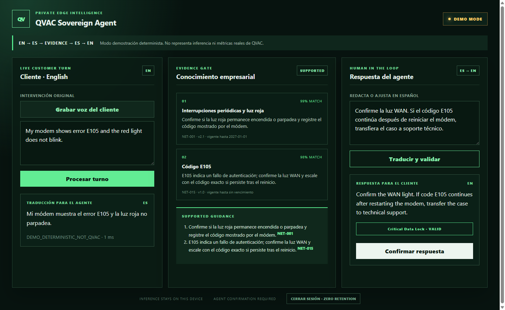

# QVAC Sovereign Agent

Copiloto bilingüe y local para centros de atención. Un cliente habla inglés; QVAC transcribe su voz, TranslatePsy la traduce al español, RAG encuentra procedimientos vigentes y el agente recibe `Supported Guidance` con fuentes. El agente redacta en español, revisa la traducción al inglés y confirma antes de responder.

La ruta principal de IA se ejecuta en el dispositivo con `@qvac/sdk`. El prototipo no usa APIs externas de IA.



## Qué funciona

- Entrada escrita o grabación del micrófono del cliente.
- ASR inglés local con Parakeet Unified.
- Traducción EN ↔ ES local con los paquetes TranslatePsy/Bergamot de QVAC.
- RAG local sobre 20 documentos ficticios de telecomunicaciones en español.
- `Evidence Gate`: solo muestra guías respaldadas por documentos activos y vigentes.
- `Critical Data Lock`: bloquea una respuesta si cambian códigos, números o negaciones.
- Confirmación humana obligatoria.
- Zero-Retention Mode: al cerrar la sesión se elimina el contenido de la interfaz; los archivos temporales de audio se borran incluso si la transcripción falla.
- Registros JSONL de rendimiento y evaluación reproducible.

## Requisitos

- Windows 10/11 x64.
- Node.js 22.17.0 o posterior.
- npm 10.9.2 o posterior.
- Vulkan 1.4 o posterior.
- Al menos 5 GB libres.
- Micrófono para la captura real.

`ffmpeg` se instala localmente mediante `ffmpeg-static`; no hace falta un gestor de paquetes del sistema.

## Instalación

```powershell
git clone https://github.com/Reggie1103/hackathon.git
cd hackathon
npm install
npm run doctor
```

La primera prueba real descarga los modelos en la caché de QVAC del usuario. Después se reutilizan sin volver a descargarlos.

## Ejecutar la aplicación

```powershell
npm run dev
```

El modo predeterminado utiliza QVAC real. Para desarrollar la interfaz sin cargar modelos:

```powershell
$env:QVAC_RUNTIME_MODE="demo"
npm run dev
```

La interfaz identifica el modo demo en amarillo y declara que sus resultados no son métricas QVAC.

## Verificaciones reproducibles

```powershell
npm test
npm run typecheck
npm run build
npm run smoke:translate
npm run smoke:rag
npm run smoke:asr
npm run smoke:flow
npm run evaluate:rag
```

Las pruebas de humo usan contenido ficticio. `npm run smoke:asr` genera voz inglesa con el sintetizador local de Windows, la convierte a WAV 16 kHz mono y elimina los audios al terminar.

## Modelos y formatos reales

| Función | Identificador declarado por `@qvac/sdk` 0.19.0 | Formato / cuantización | Tamaño principal |
|---|---|---|---:|
| Traducción EN → ES | `BERGAMOT_EN_ES` | paquete Bergamot INTGEMM | 31,561,787 bytes + companions |
| Traducción ES → EN | `BERGAMOT_ES_EN` | paquete Bergamot INTGEMM | 31,561,787 bytes + companions |
| Embeddings RAG | `EMBEDDINGGEMMA_300M_Q4_0` | GGUF Q4_0 | 277,852,192 bytes |
| ASR inglés | `PARAKEET_UNIFIED_0_6B_Q4_0` | GGUF Q4_0 | 395,029,120 bytes |

Los nombres anteriores son los identificadores reales del registro QVAC. La aplicación no presenta un alias inventado como si fuera el nombre del modelo.

## Resultados medidos en el hardware de la demo

Hardware: HP Victus, Intel i5-12450H, 15.7 GB RAM, NVIDIA RTX 3050 Laptop 4 GB, Vulkan 1.4.325.

- Traducción EN → ES: 509 ms; 24 tokens; 50.26 tokens/s. Primera carga con descarga: 16.85 s.
- Traducción ES → EN: 387 ms; 12 tokens; 32.74 tokens/s. Primera carga con descarga: 8.42 s.
- ASR Parakeet: 890 ms para un audio sintético de 4.7 s; el código hablado “E one zero five” se transcribió como `E105`.
- RAG caliente: 7–15 ms por consulta después de cargar e indexar.
- Evaluación RAG: 88.9 % `Precision@1` sobre 18 casos con respuesta y 100 % de abstención sobre dos casos fuera del dominio, con umbral 0.50.
- Turno completo en frío con modelos ya descargados: 7.45 s para EN → ES → RAG → ES → EN.

Son mediciones de una ejecución local, no garantías para otro hardware. Los registros completos están en [`artifacts/`](./artifacts/).

## Límites conocidos

- La captura actual procesa el audio después de detener la grabación. Streaming parcial con fin de turno queda como siguiente mejora.
- La colección es ficticia y pequeña; no representa la complejidad de una base empresarial real.
- El umbral 0.50 se calibró con 20 casos. Requiere recalibración por empresa y colección.
- TranslatePsy puede producir una traducción gramatical pero poco natural. El agente siempre ve ambos textos y debe aprobar la respuesta.
- `Critical Data Lock` protege patrones de códigos/números y presencia de negación; todavía no valida significado completo.
- La guía es extractiva. No se carga un LLM generativo en el MVP, lo que reduce memoria, latencia y riesgo de inventar procedimientos.
- Una llamada VoIP o un CRM pueden necesitar internet. La afirmación de privacidad se limita a la inferencia de IA y al conocimiento procesados localmente.

## Documentación

- [Diseño detallado del producto](./PROJECT_TRANSLATEPSY.md)
- [Especificación implementable](./docs/SPEC.md)
- [Tickets y orden de ejecución](./docs/TICKETS.md)
- [Guion de demo](./docs/DEMO.md)
- [Rendimiento y metodología](./docs/PERFORMANCE.md)
- [Modelo de dominio](./CONTEXT.md)

Proyecto publicado bajo licencia MIT.
